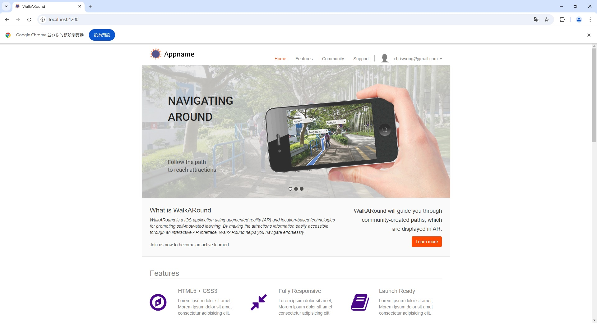

# WalkARound Web Application

## Overview

This project is a Node.js-based frontend web application designed to support a mobile app that utilizes augmented reality (AR) and location-based technologies. The web application allows users to create and manage navigational tours aimed at promoting self-motivated learning experiences.

## Features

- **Tour Creation**: Users can create new tours by inputting relevant details such as title, description, location, and multimedia content
- **Tour Management**: The application provides functionalities to edit and delete existing tours, ensuring users can maintain up-to-date information
- **User-Friendly Interface**: The web application is designed with a focus on usability, allowing users to navigate easily and manage tours efficiently

## Installation

1. Clone the repository:

   ```bash
   git clone <repository-url>
   cd <project-directory>
   ```

2. Install dependencies:

   ```bash
   npm install
   ```

3. Run the Angular application:

   ```bash
   ng serve
   ```

4. Access the application in your browser:

   ```bash
   http://localhost:4200
   ```

## Demo



## Important Notes

- Ensure the backend services for the mobile app are properly set up to handle requests from this frontend application
- The web application should be tested for compatibility with various devices to ensure a seamless user experience

## Disclaimer

This project is intended for educational and research purposes only. Users should ensure compliance with all applicable laws and regulations when utilizing this software.
